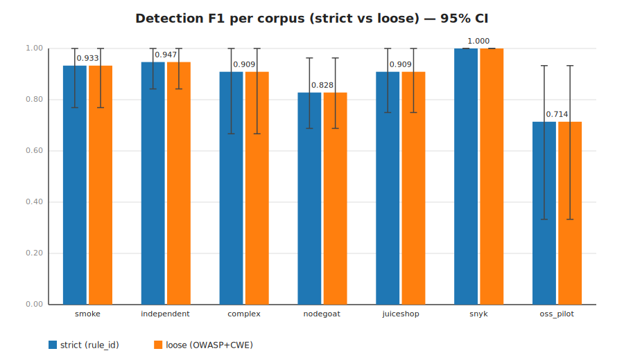
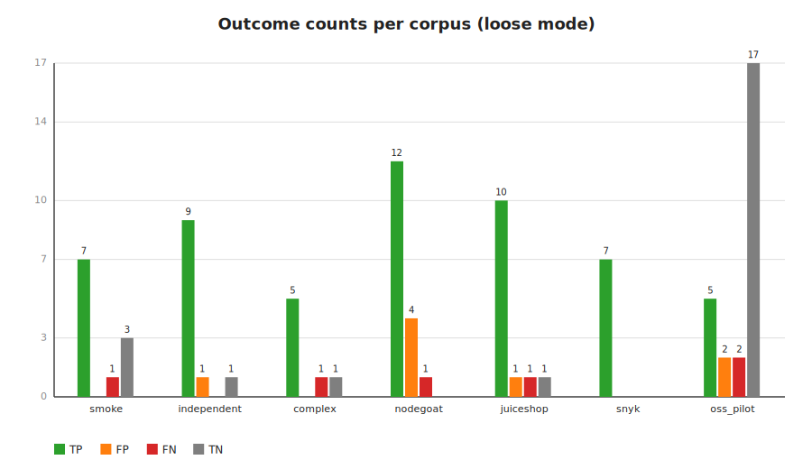
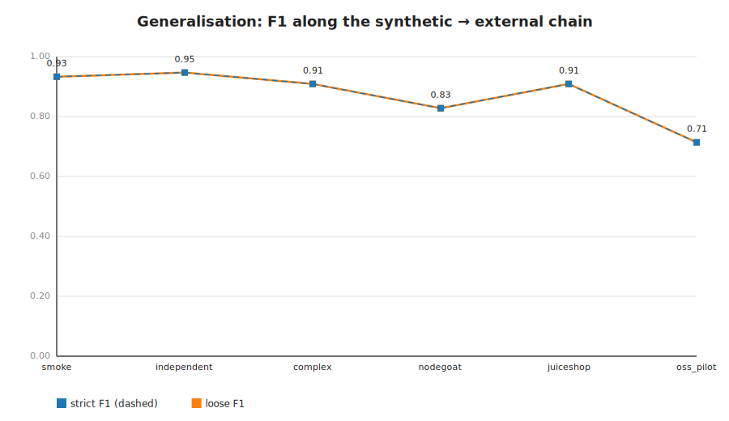
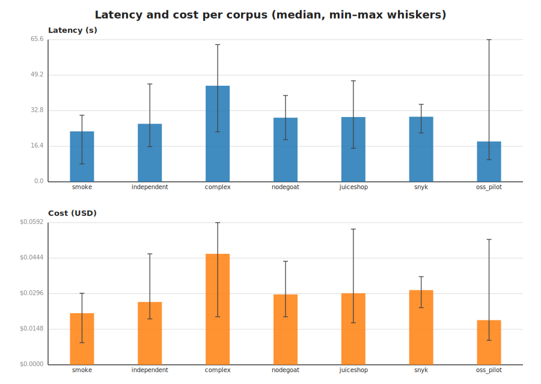
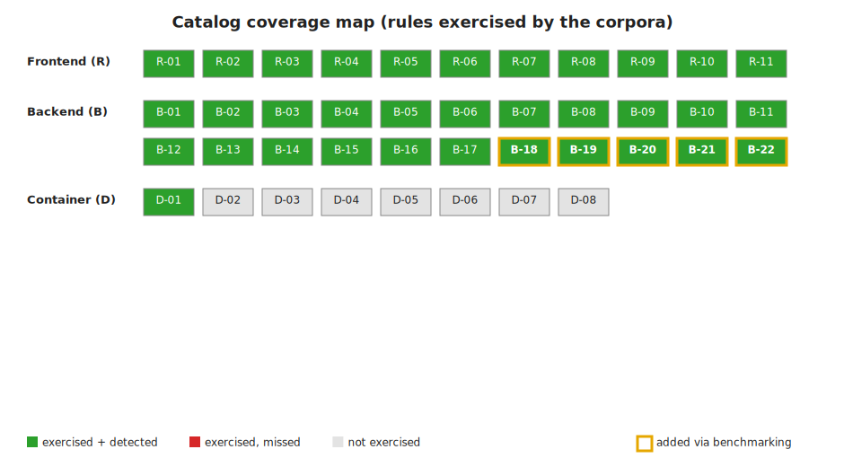

# Benchmark figures

_Rendered from `results.md` (generated 2026-06-07T22:26:19.857Z)._

Provider: openai · model: gpt-5 · 7 corpora · 3 seed(s) per case.

## F1 per corpus (strict vs loose)

PNG: `f1_per_corpus.png` · SVG: `f1_per_corpus.svg`

## Outcome counts per corpus

PNG: `confusion_matrix.png` · SVG: `confusion_matrix.svg`

## Generalisation gap

PNG: `generalisation_gap.png` · SVG: `generalisation_gap.svg`

## Latency and cost per corpus

PNG: `latency_cost.png` · SVG: `latency_cost.svg`

## Catalog coverage map

PNG: `coverage_map.png` · SVG: `coverage_map.svg`

